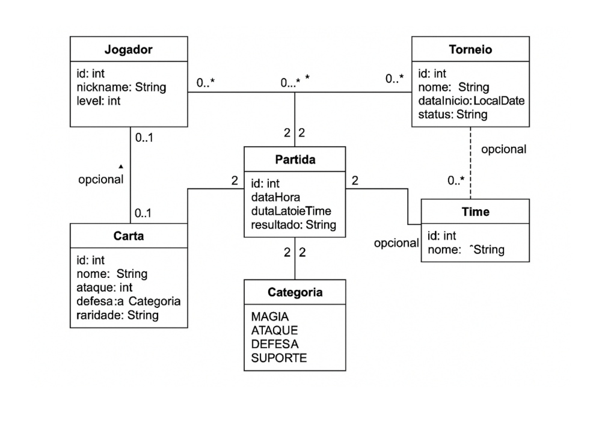

---

````markdown
# 🏆 Sistema de Gerenciamento de Times de Jogo (LPOO)

Este projeto tem como objetivo aplicar os conceitos de Programação Orientada a Objetos com Java e persistência de dados utilizando JPA, dentro do padrão de arquitetura **MVC**. O sistema permite o cadastro, edição e exclusão de **jogadores** e **times**, com interface gráfica desenvolvida em **Java Swing**.

---

## ✅ Funcionalidades Implementadas

- Cadastro de **Jogadores**
  - Nickname, Level e outras informações
  - Persistência com banco de dados
- Cadastro de **Times**
  - Definição do nome do time
  - Seleção de jogadores para compor o time
- Listagem e remoção de jogadores e times
- Interface gráfica interativa (Java Swing)
- Banco de dados integrado com JPA (PostgreSQL)
- Projeto organizado em pacotes `model`, `view` e `control` (MVC)

---

## 📌 Tecnologias Utilizadas

- **Java 11+**
- **Java Swing** (interfaces gráficas)
- **JPA (Hibernate)**
- **PostgreSQL** (banco de dados)
- **Maven** (gerenciador de dependências)

---

## 📂 Estrutura de Pastas

```bash
src/
 └── model/      # Entidades JPA (Jogador, Time)
 └── control/    # Persistência e lógica de negócio
 └── view/       # Telas (JFrame/JDialog)
````

---

## ⚙️ Como Executar

1. Clone o repositório:

   ```bash
   git clone https://github.com/MuriloBoss/Projeto-Final-LPOO
   ```

2. Configure o banco PostgreSQL:

   * Crie um banco chamado `db_lpoo_torneios`
   * Atualize o arquivo `persistence.xml` com usuário e senha corretos

3. Execute o projeto via IDE (NetBeans, IntelliJ ou Eclipse)

---

## 🔜 Funcionalidades Futuras

* Cadastro e gerenciamento de **Partidas/Torneios**
* Relacionamento entre **Cartas** e **Jogadores**
* Estatísticas de desempenho
* Geração de relatório em PDF ou CSV

---

## 📐 Diagrama de Classes UML

O diagrama abaixo representa a modelagem do sistema, com os principais relacionamentos entre as entidades:




## 👨‍💻 Autor

Murilo Ossanes
Projeto final para a disciplina de **LPOO (Linguagem de Programação Orientada a Objetos)**

---

## 📝 Licença

Este projeto é apenas para fins acadêmicos.

```
